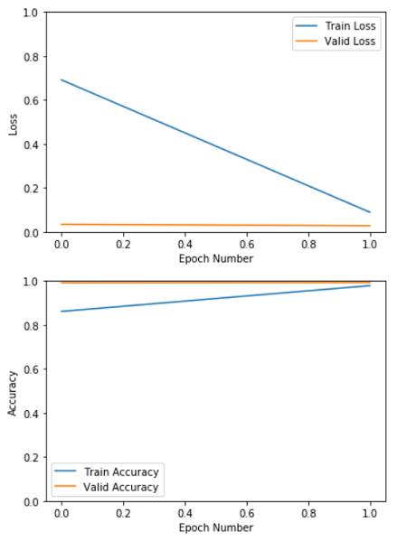

<header>
    <h1>Project Fruit360</h1>
    
AI For Social Change

</header>

 **Zero Hunger** by 2030 is [Goal 2 of the United Nations Sustainable Development Goals](https://www.un.org/sustainabledevelopment/hunger/). 

An estimated 821 million people were undernourished in 2017. In addition, 149 million children under 5 years of age (22 per cent of the global under-5 population) were still chronically undernourished in 2018. 
Therefore,*a profound change in the global food and agriculture system is needed to nourish* the 815 million people who are hungry today and the additional 2 billion people expected to be undernourished by 2050. This because the world will need a lot more food, and farmers will face serious pressure to keep up with demand. It is therefore time to reexamine how we grow, share and consume our food. 

In our own little way, through this project we try to make steps towards the improvement of the current agricultural system by using AI in agriculture. 

**The objective of this project** is to create a machine learning model that can be used by robots in harvesting, picking, sorting and packing of fruits and vegetables. With robots doing these slow and repetitive tasks, farmers can focus more on other tasks that improve the overall production yields and most likely at a lower cost.This is also a stepping stone to more advanced predictive analytics such as yield prediction.

## What does our project do?
You upload an image of a fruit on our website and our model tells you what fruit it is. Our model can identify 118 different fruits and vegetables. We got a test accuracy of a whooping 99% :clap:

## How was our model built?

### Dataset
We used the [Fruits360 dataset](https://kaggle.com/moltean/fruits) from Kaggle

### Dataset properties
**Total number of images:** 80653.

**Training set size:** 60318 images (one fruit or vegetable per image).

**Test set size:** 20232 images (one fruit or vegetable per image).

**Multi-fruits set size:** 103 images (more than one fruit (or fruit class) per image)

**Number of classes:** 118 (fruits and vegetables).

**Image size:** 100x100 pixels.

### Architecture
Transfer Learning is a method in deep learning where a model that is developed to solve one task is reused as a starting point for another task. Say for example you want to build a network to identify birds, Rather than writing a model from scratch which can be a very complex task, to say the least, you can use an already existing model that was developed to do the same or similar task (in our case of recognizing birds we could use a network that recognizes other animals).
The advantage of using transfer learning; the learning process is faster, more accurate and requires less training data.The already existing model is called a Pre-trained model. 

In Pytorch it is easy to load pre-trained networks based on ImageNet which are available from torchvision. We used different pre-trained models to train our network.
Our model was built on Google Colab using the following steps (Notebook can be found [here](https://colab.research.google.com/github/amalphonse/SPAIC_sg_fruit_360/blob/master/Ivy_Fruits360_With_Pytorch.ipynb):

1. Load data and Perform Transformations
2. Build the Model
3. Train the Model
4. Test the Model on Unseen Data

We tried out 4 Pre-trained models: VGG19, Resnet152, Densenet161 and Inception_V3. The final model we chose, had the following hyperparameters:

| HyperParameter    | Values               |
|-------------------|----------------------|
| Pre-trained Model | **Inception V3**     |
| Epoch            | **20**               |
| Loss              | **CrossEntropyLoss** |
| Criterion         | **SGD**              |
| Learning Rate     | **0.001**            |
| Momentum          | **0.9**              |
| Scheduler         | **StepLR**           |

## Results
**Training Accuracy:** 97.88%    

**Validation Accuracy:** 99.24%

**Test Accuracy:** 99%

The images below show a plot of our training and validation loss and accuracy respectively. These plots were useful in showing us if our training model was overfitting or not. It can be noticed that our model did not overfit.

Graphs                     |  Test Accuracy
:-------------------------:|:-------------------------:
      |  

##  What are the potential uses of our model?

- While going for a walk outdoors, an adventure or even shopping for grocceries, you might come across Fruits or vegetables you don't know. All you need to do is open our website upload the picture and you'll learn something new :smile:

- Can be used by robots in 
    - Harvesting and Picking
    - Sorting and Packing

This can go a long way in improving the agricultural process and operations. Leading to improved yield and more food in the world

- Can be used in Fruit Counting and therefore yield estimation or predicition

## Participants
Anju Mercian - @Anju Mercian

Ngong Ivoline - @Ivy

Urvi Soni - @Urvi Soni

Shudipto Trafder - @Shudipto Trafder
